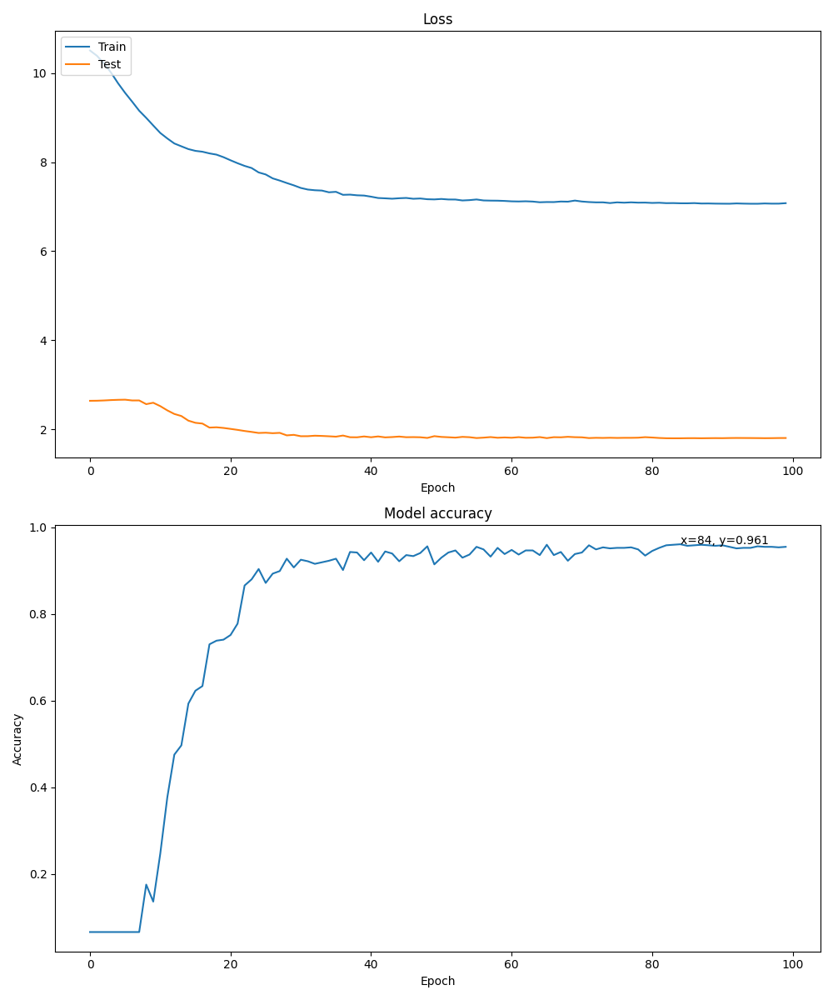
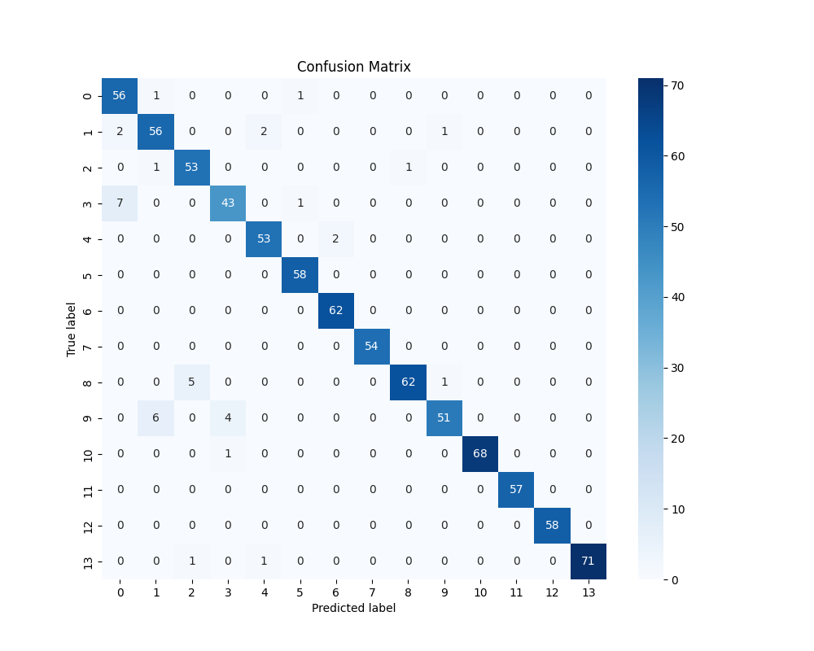

# Hand-Gesture

## DDNet - Nhận Diện Hành Động Tay Realtime

- **DDNet** là một mô hình AI mạnh mẽ được thiết kế để nhận diện hành động tay trong thời gian thực. Ứng dụng của mô hình này có thể được sử dụng trong các hệ thống tương tác thông minh, kiểm soát thiết bị không cần chạm, và nhiều ứng dụng khác liên quan đến nhận dạng cử chỉ.
- Dự án này triển khai lại bài báo: **Make Skeleton-based Action Recognition Model Smaller, Faster and Better** của Fan Yang, Sakriani Sakti, Yang Wu, Satoshi Nakamura. Link bài viết tham khảo: https://arxiv.org/pdf/1907.09658v8
## Bộ dữ liệu dùng để huấn luyện SHREC 2017:

- **SHREC 2017** bao gồm 2800 ảnh được chia cho 14 label,các bàn tay được đánh 22 điểm khớp. Trong dự án này, chúng tôi đã chia sẵn tập train, test thành các file pkl nằm trong thư mục **/data**. Link tải dataset tham khảo: http://www-rech.telecom-lille.fr/shrec2017-hand/
## Kết quả huấn luyện: 




## Tính Năng Chính

- **Nhận diện hành động tay realtime**: Mô hình có khả năng nhận diện các hành động tay phổ biến như vẫy tay, vuốt trái, vuốt phải, và nhiều hơn nữa.
- **Độ chính xác cao**: DDNet được tối ưu hóa để đảm bảo độ chính xác cao trong môi trường thực tế.
- **Hiệu suất cao**: Có thể xử lý video với tốc độ khung hình cao, đảm bảo trải nghiệm mượt mà cho các ứng dụng thời gian thực.

## Yêu Cầu Hệ Thống

- **Hệ điều hành**: Windows, macOS, Linux
- **Ngôn ngữ lập trình**: Python 3.x
- **Các thư viện phụ thuộc**:
  - PyTorch

## Cài Đặt

Hướng dẫn cài đặt và chạy mô hình DDNet trên máy cục bộ:

```bash
# Clone repository này
https://github.com/HITAINTELIGENCE/Hand-Gesture.git

# Cài đặt các thư viện phụ thuộc
pip install -r requirements.txt
```
**Mở 1 terminal hàm main.py chạy code:**
```bash
uvicorn main:app --reload
```
**Mở 1 terminal hàm app_streamlit.py chạy code:**
```bash
streamlit run app_streamlit.py